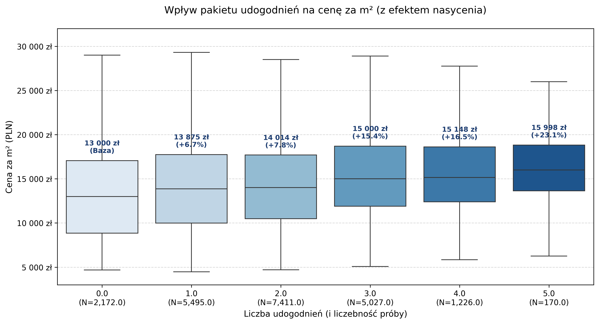
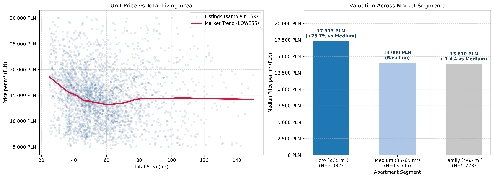
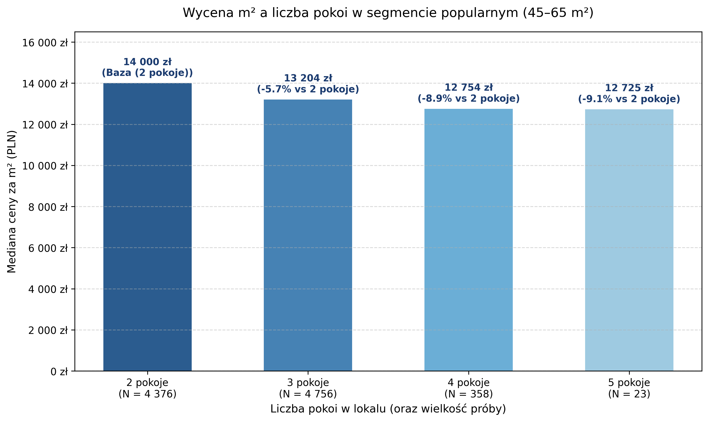
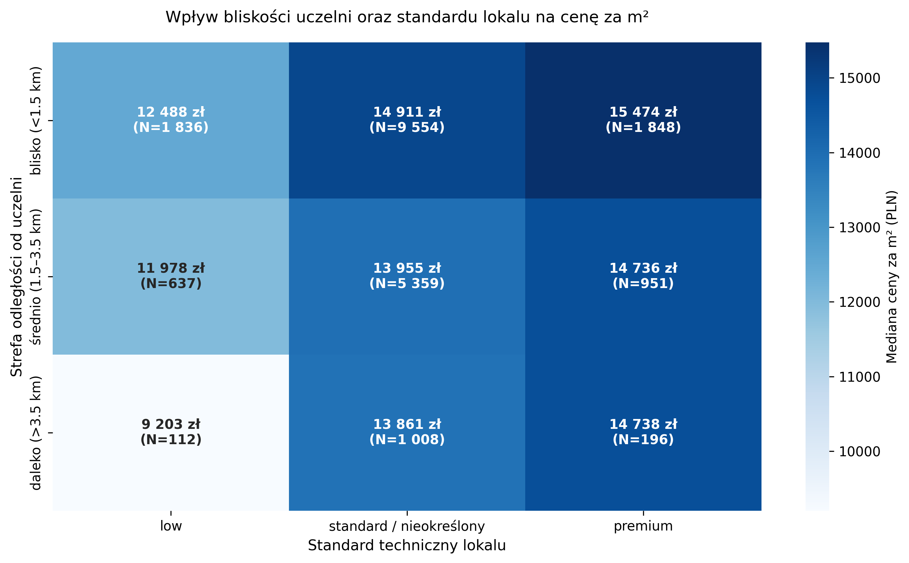
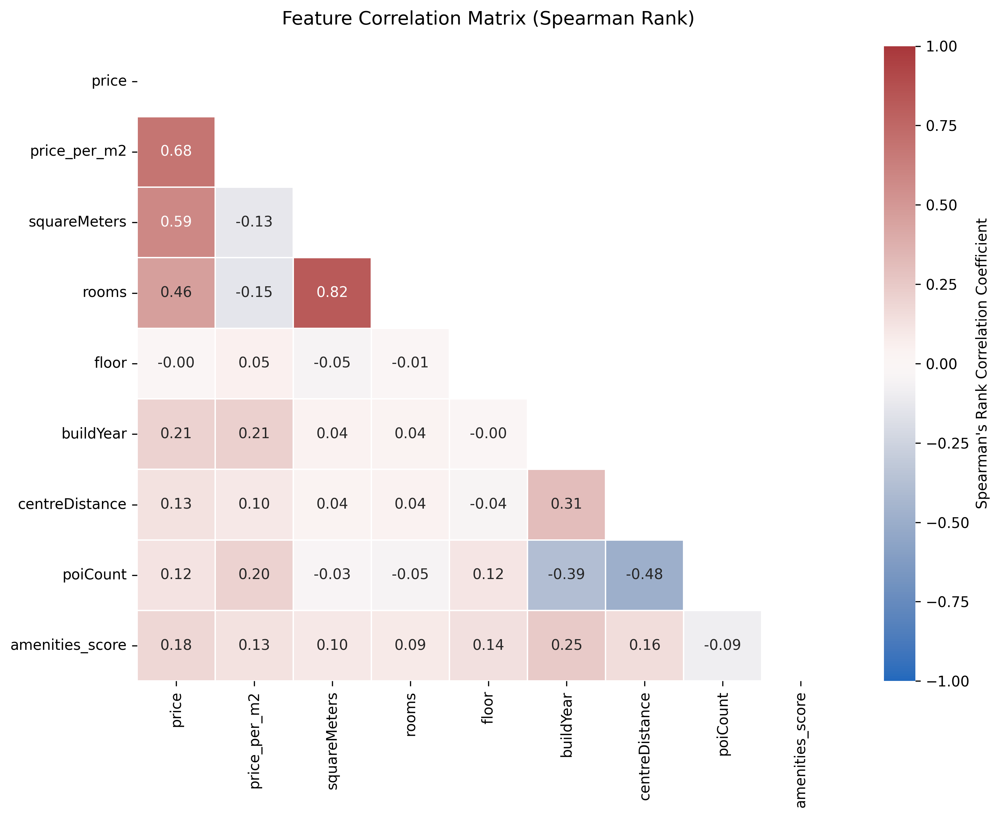

# 🏢 Polish Residential Real Estate Market Analysis (June 2024)
### Exploratory Data Analysis, Statistical Hypothesis Testing & Market Segmentation


[](https://colab.research.google.com/github/adamkubi456/polish-housing-market-eda/blob/main/polish_housing_eda.ipynb)
---

## 📌 Executive Summary

This project delivers an end-to-end data analysis of the Polish residential housing market based on over **21,000 apartment listings** from June 2024. Beyond descriptive statistics, the study formulates and tests **four specific investment hypotheses** using non-parametric statistical methods (**Mann-Whitney U**, **Kruskal-Wallis H**). 

The analysis reveals critical microeconomic patterns, such as the **amenities saturation ceiling**, **micro-apartment valuation premiums**, room density dynamics, and a pronounced **Simpson's Paradox** emerging from inter-city price aggregation.

---

## 🔑 Key Insights & Business Findings

1. **Amenities Saturation Ceiling:** Adding basic conveniences (balcony, elevator, parking) increases unit valuation up to an **Amenities Score of 3 (+19.4% median premium)**. Accumulating further amenities yields diminishing returns, as premium properties hit an affordability ceiling.
2. **Micro-Apartment Premium (+23.7%):** Compact studios (≤ 35 m²) command a statistically significant unit premium over mass-market flats (35–65 m²), driven by lower nominal ticket size and high rental yields.
3. **Room Density Paradox:** Within the identical area envelope (45–65 m²), **2-room flats are valued 5.7% higher per m² than 3-room configurations**. Market preference prioritizes ergonomic living space over partitioned room count.
4. **Student Hub Protection for Distressed Assets:** Proximity to academic institutions acts as a valuation cushion: unrenovated/distressed properties located < 1.5 km from universities retain a **+35.7% unit price premium** compared to distant counterparts.
5. **Simpson's Paradox in Spatial Distance:** While pooled national data indicates a counter-intuitive positive correlation between distance to center and price per m² (r = +0.10), this is an artifact of high-priced capital city suburbs. Within individual cities, distance maintains a strong negative relationship.

---

## 📊 Hypothesis Deep Dives

### 🧪 Hypothesis 1: Amenities Bundle Premium & Saturation Effect
> **Hypothesis:** Each additional convenience (parking, elevator, balcony, security, storage) increases valuation in a linear fashion.  
> **Result: Confirmed (Non-linear Saturation).**  
> *Test:* Kruskal-Wallis H = 386.58, p = 2.32e-81 (α = 0.01).

Valuation increases rapidly as properties move from 0 amenities (baseline) to 3 amenities. However, properties with 4 and 5 amenities plateau around 16,000 PLN/m², reflecting affordability resistance among buyers.



---

### 🧪 Hypothesis 2: Micro-Apartment Valuation Premium
> **Hypothesis:** Small apartments (≤ 35 m²) trade at significantly higher price per m² than medium-sized units (35–65 m²).  
> **Result: Confirmed.**  
> *Test:* Mann-Whitney U = 1.86e+07, p = 6.38e-112 (α = 0.01).

Micro-apartments trade at a median of **15,695 PLN/m² (+23.7% premium)** compared to medium units (12,689 PLN/m²). The LOWESS regression curve illustrates steep economies of scale: per-square-meter prices decline sharply between 20 m² and 60 m² before flattening for larger family residences.



---

### 🧪 Hypothesis 3: Room Density vs. Unit Valuation (45–65 m²)
> **Hypothesis:** Dividing a mid-sized apartment into 3 rooms creates higher unit value than a standard 2-room layout.  
> **Result: Rejected.**  
> *Test:* Mann-Whitney U = 9.24e+06, p < 1e-15 (tested 3 rooms < 2 rooms).

Controlling for square meters, **2-room layouts achieve a median price of 12,689 PLN/m²**, whereas 3-room configurations achieve **11,962 PLN/m² (-5.7%)**. Buyers penalize overly fragmented layouts with narrow bedrooms and unfunctional kitchenettes in favor of spacious, open-plan living rooms.



---

### 🧪 Hypothesis 4: Student Hub Resilience for Distressed Units
> **Hypothesis:** Close proximity to universities protects the valuation of apartments requiring renovation (`condition = low`).  
> **Result: Confirmed.**  
> *Test:* Mann-Whitney U = 1.28e+05, p = 3.28e-06 (α = 0.01).

Properties in low condition located < 1.5 km from university campuses command **13,296 PLN/m²** vs. **9,800 PLN/m²** for those > 3.5 km away (**+35.7% price resilience**). The structural demand of the student rental market shields unrenovated assets from typical price penalties.



---

## 📈 Correlation Analysis & Simpson's Paradox

The feature correlation matrix (Spearman Rank) details the relationships across continuous and ordinal attributes:



* **Multicollinearity:** Total area (`squareMeters`) and room count (`rooms`) exhibit strong collinearity (r = 0.82), which requires dimensionality reduction or regularization (Ridge/Lasso) before predictive modeling.
* **Simpson's Paradox:** The pooled correlation between `centreDistance` and `price_per_m2` appears positive (r = +0.10). This is an aggregation distortion: suburban districts of tier-1 cities (e.g., Warsaw, Kraków) have higher absolute price levels than central districts of secondary cities (e.g., Radom, Częstochowa). Within any single city, distance to center is strictly negatively correlated with unit price.

---

## 🗺️ Geospatial Exploration

Interactive spatial mapping in Plotly highlights clear valuation clusters and price decay radiating from the capital center along rapid transit arteries.

* 🌐 **[Launch via GitHub Pages](https://adamkubi456.github.io/polish-housing-market-eda/assets/warsaw_price_map.html)** 

---

## 📑 Summary of Statistical Inference

| # | Hypothesis | Statistical Test | Test Statistic | p-value | Significance (α = 0.05) | Empirical Verdict |
|---|---|---|---|---|---|---|
| **H1** | Amenities bundle value effect (0–5) | Kruskal-Wallis H | 386.58 | 2.32e-81 | **Yes** | **Confirmed** (Saturation at score 3) |
| **H2** | Micro-unit valuation premium (≤ 35 m²) | Mann-Whitney U | 1.86e+07 | 6.38e-112 | **Yes** | **Confirmed** (+23.7% unit premium) |
| **H3** | Higher valuation for 3 vs 2 rooms (45–65 m²) | Mann-Whitney U | 9.24e+06 | 1.00 (one-sided) | **No** | **Rejected** (2-room units lead by 5.7%) |
| **H4** | University proximity shields low-condition units | Mann-Whitney U | 1.28e+05 | 3.28e-06 | **Yes** | **Confirmed** (+35.7% price cushion) |

---

## ⚠️ Project Limitations & Domain Assumptions

1. **Asking Prices vs. Transaction Prices:**  
   The dataset consists exclusively of web-scraped asking (listing) prices. In the Polish real estate market, actual transaction prices historically deviate downward by 5% to 15% due to negotiation margins and mortgage qualification timelines.
2. **Condition Variable Missingness:**  
   The `condition` feature exhibits an ~80% missing data rate. In Polish classifieds, realtors actively declare condition when it is a primary marketing advantage (`refurbished / premium`) or when disclosing required overhaul (`low / for renovation`), leaving standard properties unlabeled.
3. **Cross-Sectional Data:**  
   Data represents a single point in time (June 2024). Consequently, it does not capture time-series price adjustments, listing duration, or the impact of government housing loan subsidy cycles.

---

## 💻 Tech Stack & Methods

* **Language:** Python 3.10+
* **Data Manipulation:** `pandas`, `numpy`
* **Statistical Inference:** `scipy.stats` (Mann-Whitney U, Kruskal-Wallis H)
* **Visualization:** `matplotlib`, `seaborn`, `statsmodels` (LOWESS trend)
* **Interactive Mapping:** `plotly.express` (Mapbox with Esri raster layers)

---

## 🚀 How to Reproduce

1. **Clone the repository:**
   ```bash
   git clone [https://github.com/adamkubi456/polish-housing-market-eda.git](https://github.com/adamkubi456/polish-housing-market-eda.git)
   cd polish-housing-market-eda

## 👤 Author

* **Adam Kubiak**
* LinkedIn: [Adam Kubiak](https://www.linkedin.com/in/adam-kubiak-22b655431/)
* GitHub: [@adamkubi456](https://github.com/adamkubi456)
* Email: adamkubi456@wp.pl
